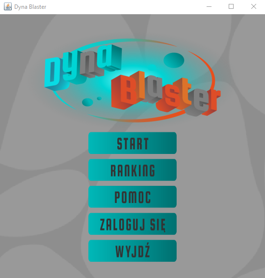
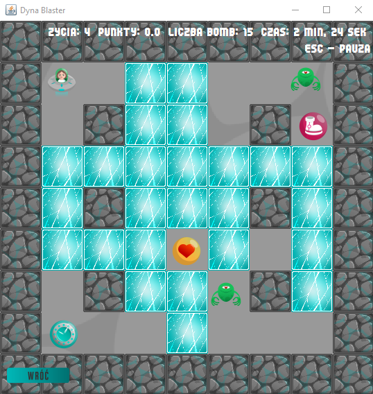

# Game-Dyna-Blaster
Game in 2D. This application was created as a part of PROZE course. 

  |  
:-------------------------:|:-------------------------:
*Menu* | *Game*

**Steps to execute the game:**
1. Compile server ```.Serwer/kompilacja_serwera.bat```
2. Run server ```.Serwer/uruchamianie_serwera.bat```
3. Compile game ```Kompilacja.bat```
4. Run game ```DynaBlaster.bat``` 

*For more details and information about game and requirements go to [instruction](./instrukcja.pdf) (only Polish version)*

**Authors:**
* Dorota Floriańczyk, Krzysztof Sadura
